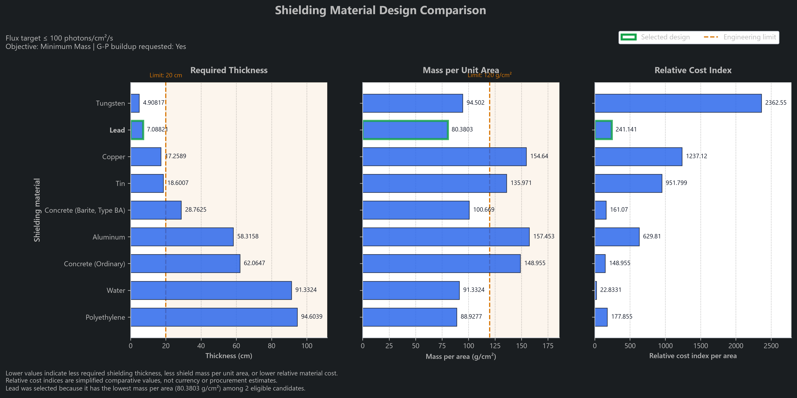
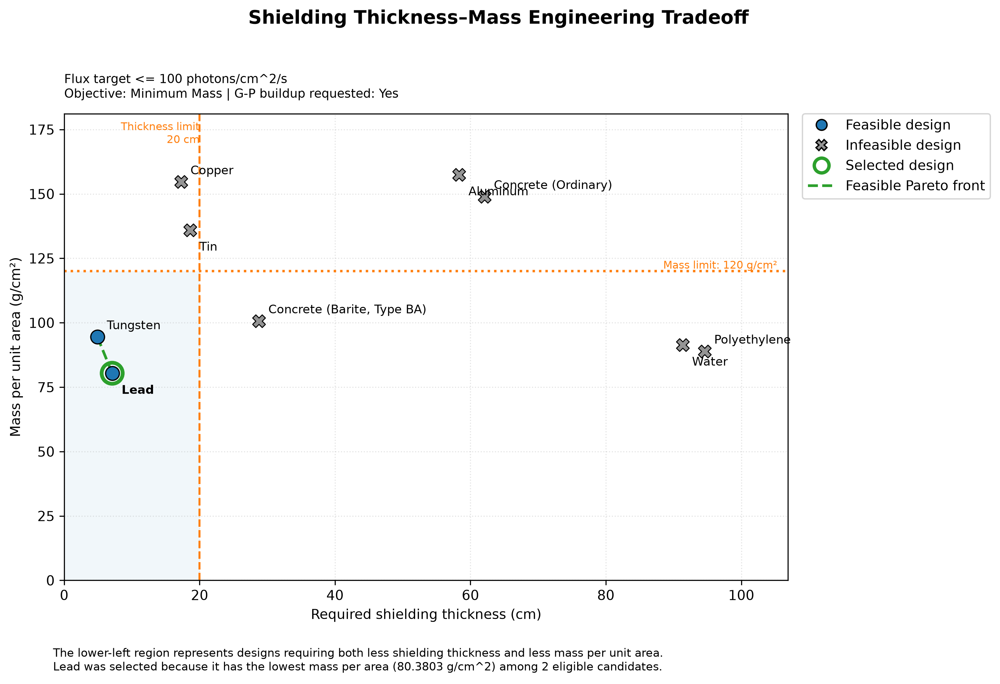

# Shielding Attenuation Simulator

A Python photon-shielding analysis and engineering design tool using NIST XCOM attenuation data, isotope photon-source models, G-P exposure buildup factors, engineering constraints, Pareto analysis, reproducible scenarios, and OpenMC-ready spherical geometry.

## Overview

The Shielding Attenuation Simulator models photon attenuation from an isotropic point source through shielding materials.

The project began as a basic Java attenuation calculator and has developed into a validated Python shielding-design workflow capable of:

- calculating narrow-beam photon attenuation;
- modeling selected isotope photon spectra;
- estimating single-layer exposure buildup;
- solving for minimum shielding thickness;
- comparing candidate materials;
- applying thickness, mass, and relative-cost constraints;
- ranking feasible designs under multiple objectives;
- visualizing engineering tradeoffs;
- loading complete design scenarios from JSON;
- defining concentric spherical shielding geometry;
- preparing shared inputs for future OpenMC benchmarking.

The current release is **V1.11**.

## Current Capabilities

### Photon Transport Models

- Beer-Lambert narrow-beam attenuation
- Multilayer transmission
- NIST XCOM mass attenuation data
- Log-log attenuation-coefficient interpolation
- Linear attenuation and mean-free-path calculations
- Inverse-square point-source spreading
- Manual monoenergetic photon sources
- Selected isotope photon spectra
- Line-by-line isotope response summation
- G-P exposure buildup for supported homogeneous shields

### Shielding Design

- Transmission targets
- Reduction-factor targets
- Detector-response targets
- Analytical and numerical minimum-thickness solutions
- Single-material comparison
- Engineering constraint filtering
- Minimum-thickness optimization
- Minimum-mass optimization
- Minimum-relative-cost optimization
- Weighted balanced optimization
- Explicit `ELIGIBLE`, `REJECTED`, and `FAILED` design states
- Thickness-mass Pareto classification

### Reproducible Scenarios

V1.11 introduces a shared scenario layer:

```text
Scenario JSON
      ↓
Validated ShieldingScenario
      ↓
scenario_runner.py
      ↓
Deterministic shielding optimizer
```

A scenario can define:

- source type and activity;
- concentric spherical geometry;
- source-cavity radius;
- evaluation radius;
- candidate materials;
- target;
- engineering constraints;
- optimization objective;
- deterministic calculation settings.

The same scenario foundation is planned to support the OpenMC backend beginning in V1.13.

**[View the V1.11 architecture diagram](docs/architecture/v1.11_scenario_architecture.md)**

## Reference Engineering Case

The official reference scenario models:

- Source: Cs-137
- Activity: 1.00 Ci, or 3.70 × 10¹⁰ Bq
- Evaluation radius: 100 cm
- Target-comparison response: 100 photons/cm²/s
- Maximum shielding thickness: 20 cm
- Maximum mass per area: 120 g/cm²
- Objective: minimum mass per area
- Candidate materials: nine
- G-P exposure buildup requested

The optimizer selects **Lead**:

```text
Required thickness: 7.08821 cm
Mass per area:      80.3803 g/cm²
Eligible designs:   Lead and Tungsten
Selected objective: Minimum mass per area
```

Tungsten is thinner, but Lead has the lower mass per area.





The plotted buildup-aware response uses G-P exposure-buildup coefficients. It is a target-comparison response proxy and should not be interpreted as generic total photon-number flux.

## Installation

Python 3.10 or newer is recommended.

Create and activate a virtual environment:

```bash
python -m venv .venv
```

Windows PowerShell:

```powershell
.\.venv\Scripts\Activate.ps1
python -m pip install -r requirements.txt
```

macOS or Linux:

```bash
source .venv/bin/activate
python -m pip install -r requirements.txt
```

## Running the Simulator

From the repository root:

```bash
cd src
python main.py
```

The command-line interface supports:

1. fixed-thickness shielding calculations;
2. minimum-thickness design;
3. material comparison;
4. constraint-based material optimization.

## Running a Reproducible Scenario

Run the official JSON scenario:

```bash
python examples/run_scenario.py
```

Run a different scenario:

```bash
python examples/run_scenario.py scenarios/example.json
```

The official scenario file is:

```text
scenarios/cs137_v110_reference.json
```

## Running Validation

From the repository root:

```bash
cd src
python validation_runner.py
```

Expected final message:

```text
All validation tests passed.
```

The current suite contains:

```text
319 total PASS assertions
46 assertions specific to V1.11
```

Coverage includes attenuation, interpolation, source handling, buildup, minimum-thickness design, material comparison, engineering optimization, Pareto analysis, plotting data, spherical geometry, scenario validation, JSON round trips, error handling, and reference-result reproduction.

## Generating Engineering Figures

From the repository root:

```bash
python examples/generate_v110_figures.py
```

The script generates four figures in PNG and SVG formats under:

```text
docs/figures/v1.10/
```

The figures cover:

- material thickness, mass, and relative cost;
- engineering constraint feasibility;
- thickness-mass Pareto tradeoffs;
- detector response versus Lead thickness.

## OpenMC Environment Test

V1.11 includes a Docker-based OpenMC photon-transport smoke test.

Launch the official OpenMC image with the repository mounted:

```powershell
docker run --rm -it `
    -v "${PWD}:/workspace" `
    -w /workspace `
    openmc/openmc:latest
```

Inside the container:

```bash
python examples/openmc_smoke_test.py
```

The verified test used OpenMC 0.15.3 and confirmed:

- access to continuous-energy photon data;
- fixed-source photon transport;
- spherical Lead-shell geometry;
- statepoint generation;
- tally extraction through Python.

This smoke test verifies environment readiness only. It is not yet a matched deterministic-versus-OpenMC benchmark.

## Project Structure

```text
shielding-attenuation/
├── docs/
│   ├── architecture/
│   ├── figures/
│   └── validation reports/
├── examples/
│   ├── generate_v110_figures.py
│   ├── openmc_smoke_test.py
│   └── run_scenario.py
├── scenarios/
│   └── cs137_v110_reference.json
├── src/
│   ├── attenuation and source modules
│   ├── buildup modules
│   ├── optimization modules
│   ├── plotting modules
│   ├── geometry_models.py
│   ├── scenario_models.py
│   ├── scenario_io.py
│   ├── scenario_runner.py
│   └── validation_runner.py
├── CHANGELOG.md
├── LICENSE
├── README.md
└── requirements.txt
```

## Current Limitations

- The deterministic optimizer currently evaluates homogeneous single-material designs.
- Multilayer attenuation is supported, but multilayer optimization is planned for a later release.
- The spherical geometry model currently defines physical inputs and shell radii; the deterministic backend still uses the evaluation radius as the center-to-detector distance.
- Total spherical shield mass is not yet calculated.
- G-P buildup is limited to supported homogeneous materials and a maximum of 40 mean free paths.
- Implemented G-P coefficients represent exposure buildup rather than generic photon-flux buildup.
- Air kerma, exposure response, energy fluence, and photon-number flux are not yet fully separated.
- Relative-cost indices are simplified comparative assumptions rather than market prices.
- The isotope library contains selected major photon lines rather than complete decay spectra.
- Source self-attenuation, encapsulation, air attenuation, and detector response are not modeled.
- OpenMC has been environment-tested but is not yet integrated with `ShieldingScenario`.
- The software is intended for conceptual engineering analysis and education, not regulatory certification.

## Documentation

Formal validation reports are available in the [`docs`](docs) directory.

Recent reports include:

- **V1.09:** Constraint-based material selection
- **V1.10:** Engineering visualization and Pareto analysis
- **V1.11:** Reproducible scenarios, spherical geometry, JSON validation, and OpenMC environment verification

The complete development history is recorded in [`CHANGELOG.md`](CHANGELOG.md).

## Roadmap

Planned major milestones:

```text
V1.12  Radiation-response quantity clarification
V1.13  Matched OpenMC photon benchmark
V1.14  Compact OpenMC benchmark study
V1.15  Two-layer spherical optimization
V1.16  Multilayer OpenMC verification
V1.17  Final Cs-137 shield-container design study
V1.18  Portfolio package and optional GUI
```

## Author

Developed by **Cormac Thomas**, B.S. Nuclear Engineering student at the University of New Mexico.

Primary interests include radiation effects, radiation-hardened electronics, shielding analysis, Monte Carlo transport, and national-security technology.

## Primary Technical References

- NIST XCOM Photon Cross Sections Database
- ANS-6.4.3 gamma-ray exposure-buildup reference data
- OpenMC photon-transport documentation
- NuDat and IAEA nuclear-decay data resources