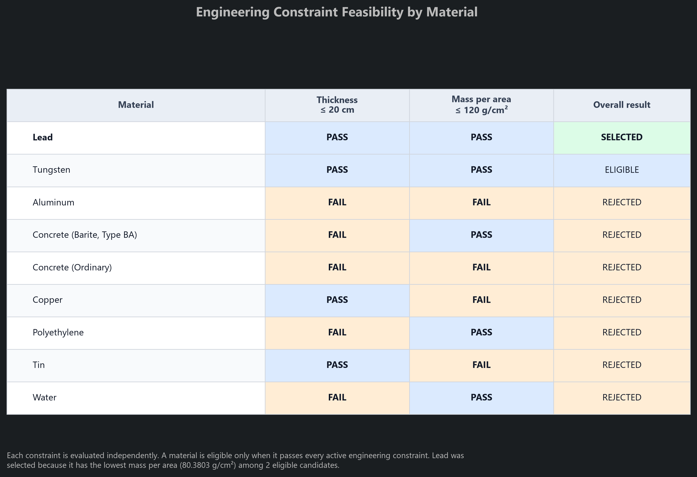
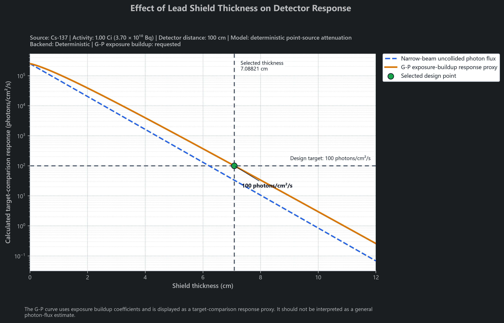

# Shielding Attenuation Simulator (v1.10)

A Python photon-shielding analysis and engineering design tool that combines NIST XCOM attenuation data, Beer-Lambert attenuation, inverse-square geometric spreading, isotope photon-source modeling, optional Geometric Progression exposure-buildup correction, target-driven minimum-thickness calculations, constraint-based material optimization, Pareto analysis, and reproducible engineering visualization.

## Overview

The Shielding Attenuation Simulator models photon transmission and detector response from an isotropic point source through shielding materials. It supports multilayer narrow-beam attenuation, selected isotope photon spectra, single-layer G-P exposure-buildup correction for supported materials, minimum shielding-thickness calculations, material comparison, engineering constraints, optimization objectives, Pareto tradeoff analysis, and publication-ready figure generation.

Version 1.10 adds a reusable visualization subsystem above the validated V1.09 constraint-based optimizer. Optimization results are converted into structured plot-data objects before rendering, allowing numerical logic to remain independent of Matplotlib. The release introduces:

- a three-panel material-design comparison;
- an engineering constraint-feasibility matrix;
- a thickness-mass Pareto tradeoff plot;
- a detector-response-versus-thickness plot;
- reproducible PNG and SVG artifact generation;
- a shared modern visual theme;
- noninteractive rendering suitable for terminals and automated workflows.

The project is intended as a nuclear engineering portfolio project focused on radiation shielding, source modeling, numerical methods, engineering optimization, validation, visualization, and future comparison with OpenMC photon transport.

## Architecture

Version 1.11 introduces a reproducible scenario layer that separates physical problem definitions from calculation backends.

```text
Scenario JSON
      ↓
Validated ShieldingScenario
      ├── Deterministic shielding and optimization
      └── OpenMC photon transport beginning in V1.13
```

The scenario stores the source, concentric spherical geometry, candidate materials, target, constraints, optimization objective, and deterministic settings. The existing physics and optimization modules remain independent of JSON parsing and file handling.

**[View the V1.11 architecture diagram](docs/architecture/v1.11_scenario_architecture.md)**

## V1.10 Engineering Visualization

The official V1.10 example uses:

- Source: Cs-137
- Activity: 1.00 Ci (3.70 × 10¹⁰ Bq)
- Detector distance: 100 cm
- Target-comparison response: ≤ 100 photons/cm²/s
- Maximum design thickness: 20 cm
- Maximum mass per area: 120 g/cm²
- Optimization objective: minimum mass per area
- Buildup setting: G-P exposure buildup requested
- Candidate set: all nine materials in the current library

Lead is selected at approximately 7.08821 cm because it has the lowest mass per area among the two materials satisfying both active engineering constraints.

### Material Design Comparison

The material comparison combines required thickness, mass per unit area, and relative cost index into one aligned figure. The same material order is preserved across all three panels.


### Engineering Constraint Feasibility

Each engineering constraint is evaluated independently. Lead and tungsten satisfy both active limits, while rejected materials remain visible with the constraint or constraints they violate.



### Thickness-Mass Engineering Tradeoff

The Pareto figure separates feasible and infeasible designs. Lead and tungsten form the feasible thickness-mass Pareto front: tungsten is thinner, while lead has lower mass per unit area.


### Detector Response Versus Shield Thickness

The response figure shows the narrow-beam uncollided photon flux separately from the G-P exposure-buildup target-comparison response proxy. The exact optimized thickness is inserted into the sampled curve.



The G-P curve uses exposure-buildup coefficients. It is displayed as a target-comparison response proxy and should not be interpreted as a general photon-number-flux estimate.

## Physics and Design Models

- **Beer-Lambert attenuation:** Calculates narrow-beam transmission through one or more shielding layers.
- **Inverse-square geometric spreading:** Calculates detector flux from an isotropic point source.
- **NIST XCOM interpolation:** Uses log-log interpolation between tabulated mass attenuation coefficients.
- **Linear attenuation conversion:** Converts mass attenuation coefficients to linear attenuation coefficients using material density.
- **Mean free path calculation:** Reports optical thickness for individual layers and the complete shield.
- **G-P buildup correction:** Applies Geometric Progression exposure-buildup factors for supported single-layer homogeneous shielding cases.
- **Isotope source calculation:** Converts source activity and photon-line intensity into photon emission rate.
- **Line-by-line isotope summation:** Calculates each selected photon line independently and sums detector response at the source-result level.
- **Target-driven shielding design:** Converts transmission, reduction-factor, and detector-response targets into equivalent target values.
- **Minimum-thickness calculation:** Uses an analytical narrow-beam solution for manual monoenergetic sources and numerical bisection for isotope or buildup-aware cases.
- **Material comparison:** Applies the same shielding problem to multiple single-material candidates.
- **Constraint-based material selection:** Filters and ranks successful candidate designs using engineering constraints and optimization objectives.
- **Pareto classification:** Identifies designs that are not dominated simultaneously in required thickness and mass per unit area.
- **Response-curve sampling:** Evaluates narrow-beam and optional buildup-aware response across an ordered shield-thickness range.

## Optimization Model

For each successful single-material candidate, the simulator calculates mass per unit area:

$$
\frac{m}{A} = \rho x
$$

where:

- $\rho$ is material density in g/cm³;
- $x$ is required shielding thickness in cm;
- $m/A$ is mass per unit area in g/cm².

The simplified relative-cost metric is:

$$
C_A = \left(\frac{m}{A}\right) I_C
$$

where $I_C$ is a dimensionless comparative cost multiplier interpreted on a relative per-unit-mass basis. Ordinary concrete is assigned a baseline value of 1.0.

These values are user-editable comparative assumptions. They are not market prices, currency, supplier quotes, or procurement estimates.

Balanced optimization applies min-max normalization among eligible candidates:

$$
N = \frac{x - x_{\min}}{x_{\max} - x_{\min}}
$$

The final weighted score is:

$$
S = \frac{w_tN_t + w_mN_m + w_cN_c}{w_t + w_m + w_c}
$$

where:

- $N_t$ is normalized required thickness;
- $N_m$ is normalized mass per unit area;
- $N_c$ is normalized relative cost index per area;
- $w_t$, $w_m$, and $w_c$ are user-selected weights.

Lower objective values and lower balanced scores are preferred.

## Pareto Model

A candidate is Pareto optimal in thickness and mass when no other eligible candidate is:

- no thicker;
- no heavier per unit area;
- and strictly better in at least one of those metrics.

Rejected and failed designs may remain visible for engineering context, but they do not define the feasible Pareto front.

In the official V1.10 case:

- Tungsten is thinner than lead.
- Lead has lower mass per unit area than tungsten.
- Neither material dominates the other.
- Both materials belong to the feasible Pareto front.
- Lead is selected because the active objective is minimum mass per area.

## Features

### Attenuation and Source Modeling

- Multilayer narrow-beam photon attenuation
- NIST XCOM mass attenuation data
- Exact lookup and log-log interpolation
- Inverse-square point-source flux
- Mean free path calculation
- Manual monoenergetic photon sources
- Isotope source modeling
- Activity conversion for Bq, kBq, MBq, GBq, Ci, mCi, and uCi
- Line-by-line isotope evaluation
- Source-level response summation

### Material and Buildup Support

- Lead
- Aluminum
- Ordinary concrete
- Barite concrete
- Water
- Tungsten
- Copper
- Tin
- Polyethylene
- G-P exposure-buildup support for:
  - lead;
  - aluminum;
  - ordinary concrete;
  - water;
  - tungsten;
  - copper;
  - tin.
- Documented narrow-beam fallback when buildup-aware design is unavailable
- Forty-mean-free-path validity limit for implemented G-P data

### Shielding Design

- Transmission targets
- Reduction-factor targets
- Detector-flux targets
- Analytical minimum-thickness calculation for manual narrow-beam cases
- Numerical bisection for isotope and buildup-aware cases
- Material comparison
- Maximum-thickness constraints
- Maximum-mass-per-area constraints
- Maximum-relative-cost constraints
- Minimum-thickness objective
- Minimum-mass objective
- Minimum-relative-cost objective
- Weighted balanced objective
- Explicit `ELIGIBLE`, `REJECTED`, and `FAILED` candidate states
- Preservation of multiple rejection reasons
- Preservation of lower-level calculation failures
- Deterministic objective-specific tie-breaking
- Infeasibility reporting when no candidate satisfies all active constraints

### V1.10 Visualization

- Structured plot-data models independent of Matplotlib
- Material comparison across thickness, mass, and relative cost
- Independent engineering constraint-feasibility evaluation
- Thickness-mass Pareto classification
- Feasible and infeasible design visualization
- Exact insertion of the optimized thickness into response curves
- Separate narrow-beam and buildup-aware response series
- Transparent handling of unavailable buildup values
- Shared visual theme and formatting system
- PNG and SVG export
- Noninteractive Matplotlib rendering through the `Agg` backend
- Reproducible four-figure engineering example
- Figure context showing source, activity, detector distance, model, target, objective, and buildup setting

### Validation

- Regression coverage for attenuation, interpolation, source handling, buildup, minimum-thickness calculations, material comparison, and optimization
- Plot-data integrity tests
- Failed-candidate metadata tests
- Pareto-classification tests
- Response-sampling tests
- Exact optimized-thickness insertion tests
- Manual and isotope response-curve tests
- Constraint-feasibility tests
- Unsupported and out-of-range buildup tests
- Invalid plotting-input tests
- Reproducible artifact-generation verification
- 273 passing assertions in the complete V1.10 validation runner
- 58 assertions specifically covering V1.10 behavior

## Project Structure

```text
shielding-attenuation/
├── docs/
│   ├── figures/
│   │   └── v1.10/
│   └── validation reports
├── examples/
│   └── generate_v110_figures.py
├── src/
│   ├── buildup.py
│   ├── calculator.py
│   ├── constraint_optimizer.py
│   ├── design_optimizer.py
│   ├── input_handler.py
│   ├── main.py
│   ├── material_cost_library.py
│   ├── material_library.py
│   ├── models.py
│   ├── optimization_models.py
│   ├── optimization_plots.py
│   ├── output.py
│   ├── physics.py
│   ├── plot_data.py
│   ├── plot_models.py
│   ├── plotting.py
│   ├── plotting_utils.py
│   ├── response_curve.py
│   ├── response_plots.py
│   ├── source_calculator.py
│   ├── source_library.py
│   ├── source_models.py
│   ├── target_models.py
│   ├── thickness_calculator.py
│   └── validation_runner.py
├── CHANGELOG.md
├── LICENSE
├── README.md
└── requirements.txt
```

The plotting architecture is divided by responsibility:

- `plot_models.py` contains validated plot-ready data structures.
- `plot_data.py` converts optimization results and performs Pareto and feasibility classification.
- `response_curve.py` performs numerical response sampling without rendering.
- `optimization_plots.py` renders optimization and material-design figures.
- `response_plots.py` renders detector-response figures.
- `plotting_utils.py` contains the shared theme, formatting, legend, and export helpers.
- `plotting.py` provides the stable public plotting API.
- `examples/generate_v110_figures.py` reproduces the official V1.10 figure set.

## Installation

The simulator requires Python 3.10 or newer.

Create and activate a virtual environment, then install the required packages:

```bash
python -m venv .venv
```

Windows PowerShell:

```powershell
.\.venv\Scripts\Activate.ps1
python -m pip install -r requirements.txt
```

macOS or Linux:

```bash
source .venv/bin/activate
python -m pip install -r requirements.txt
```

The numerical simulator primarily uses the Python standard library. Matplotlib is required for V1.10 engineering visualization and figure export.

## Running the Simulator

From the repository root:

```bash
cd src
python main.py
```

The command-line interface supports:

1. fixed-thickness shielding calculation;
2. minimum-thickness shielding design;
3. material comparison;
4. constraint-based material optimization.

## Running Validation

Run the complete regression and V1.10 validation suite:

```bash
cd src
python validation_runner.py
```

Expected final message:

```text
All validation tests passed.
```

The current complete suite produces 273 passing assertions.

## Generating the V1.10 Figures

From the repository root:

```bash
python examples/generate_v110_figures.py
```

The script:

- builds the documented Cs-137 optimization case;
- confirms that lead remains the selected material;
- generates all four finalized figures;
- saves each figure as PNG and SVG;
- closes each Matplotlib figure;
- prints a deterministic generation summary.

Authoritative outputs are written to:

```text
docs/figures/v1.10/
```

Expected files:

```text
cs137_material_design_comparison.png
cs137_material_design_comparison.svg

cs137_constraint_feasibility.png
cs137_constraint_feasibility.svg

cs137_thickness_mass_tradeoff.png
cs137_thickness_mass_tradeoff.svg

cs137_lead_response_vs_thickness.png
cs137_lead_response_vs_thickness.svg
```

## Example Constraint-Based Optimization

Example design problem:

- Source: Cs-137
- Activity: 1.00 Ci
- Detector distance: 100 cm
- Target-comparison response: ≤ 100 photons/cm²/s
- Calculation search limit: 100 cm
- G-P exposure buildup requested
- Maximum design thickness: 20 cm
- Maximum mass per area: 120 g/cm²
- Objective: minimum mass per area
- Materials considered: all available materials

```text
Material                    Thickness    Mass/Area      Rel. Cost/Area   Buildup     Status
------------------------------------------------------------------------------------------------
Lead                        7.08821      80.3803        241.141          Yes         ELIGIBLE
Tungsten                    4.90817      94.5020        2362.55          Yes         ELIGIBLE
Copper                      17.2589      154.640        1237.12          Yes         REJECTED
Tin                         18.6007      135.971        951.799          Yes         REJECTED
Concrete (Barite, Type BA)  28.7625      100.669        161.070          Fallback    REJECTED
Aluminum                    58.3158      157.453        629.810          Yes         REJECTED
Concrete (Ordinary)         62.0647      148.955        148.955          Yes         REJECTED
Water                       91.3324      91.3324        22.8331          Fallback    REJECTED
Polyethylene                94.6039      88.9277        177.855          Fallback    REJECTED
```

Lead is selected because it has the lowest mass per area among the two eligible designs. Tungsten requires less physical thickness, but its greater density produces a higher mass per area.

The result demonstrates why feasibility and objective value must remain separate. Water has the lowest simplified relative-cost index, but it is not eligible because it exceeds the maximum design thickness.

## Current Limitations

- The optimizer evaluates homogeneous single-material designs generated by the validated single-material comparison workflow.
- Multilayer narrow-beam attenuation is supported, but multilayer optimization is not yet implemented.
- Mass is compared using mass per unit area rather than total shield mass because a complete three-dimensional geometry is not yet defined.
- Relative-cost indices are simplified, user-editable comparative assumptions.
- Relative-cost values are not dollars, market prices, supplier quotes, or procurement estimates.
- The relative-cost model does not include machining, fabrication, structural support, installation, shipping, toxicity controls, or regulatory costs.
- Balanced min-max scores depend on the eligible candidate set and user-selected weights.
- Hard constraints are currently limited to maximum thickness, maximum mass per area, and maximum relative cost index per area.
- Density, attenuation data, source intensity, calculated thickness, and relative-cost values are treated as deterministic inputs without uncertainty propagation.
- G-P buildup correction supports only single-layer homogeneous shielding and is limited to 40 mean free paths.
- Barite concrete and polyethylene do not currently have implemented G-P coefficient tables.
- Water may require narrow-beam fallback when a buildup-aware target cannot be reached within the valid calculation range.
- A single comparison may include both buildup-aware designs and documented narrow-beam fallback designs.
- The implemented G-P tables contain exposure-buildup coefficients.
- The buildup-corrected response curve is a target-comparison response proxy, not a general photon-number-flux estimate.
- The simulator does not yet provide a fully separated air-kerma, exposure, energy-fluence, or dose-response model.
- The source is modeled as isotropic and point-like, with shielding thickness along a one-dimensional source-to-detector path.
- The isotope library uses selected major photon lines rather than complete evaluated decay spectra.
- Source self-attenuation, encapsulation, air attenuation, and detector-response effects are not modeled.
- Total dose rate, effective dose, and regulatory-compliance quantities are not calculated.
- Figures are validated through numerical data integrity, deterministic generation, and structural artifact checks rather than pixel-perfect image comparison.
- OpenMC benchmarking has not yet been implemented.
- The simulator currently uses a command-line interface.

## Technical Documentation

Detailed validation reports are available in the `docs` folder:

- **Validation Report V1.01:** Legacy Java attenuation, XCOM interpolation, inverse-square flux, and robustness checks.
- **Validation Report V1.02:** Python rewrite, narrow-beam attenuation, interpolation, multilayer transmission, and regression validation.
- **Validation Report V1.04:** Initial lead G-P coefficient interpolation and buildup-factor implementation.
- **Validation Report V1.05:** Expanded single-layer G-P support for seven materials.
- **Validation Report V1.06:** Isotope source modeling, activity conversion, line-by-line source summation, and buildup warnings.
- **Validation Report V1.07:** Target classes, analytical and bisection minimum-thickness calculations, buildup-aware design, and fallback behavior.
- **Validation Report V1.08:** Single-material comparison, candidate pass/fail preservation, sorting, and warning preservation.
- **Validation Report V1.09:** Constraint-based material selection, engineering metrics, hard-constraint filtering, objective ranking, balanced normalization, infeasibility handling, and regression preservation.
- **Validation Report V1.10:** Plot-data integrity, Pareto classification, response-curve sampling, constraint-feasibility visualization, reproducible figure generation, artifact verification, and regression preservation.

**[Validation Reports](https://github.com/CormacThomas/shielding-attenuation/tree/main/docs)**

## Background

Radiation shielding is essential in reactor design, radiography, nuclear safety, radiation protection, and national-security applications. This project began as a simple attenuation calculator and is evolving into a validated workflow for analyzing photon shielding, comparing candidate materials, applying engineering constraints, and eventually benchmarking deterministic designs against Monte Carlo transport.


## Author

Developed by Cormac Thomas, Nuclear Engineering, University of New Mexico.

Focus areas include radiation effects, electronics hardening, and national security technology.

## References

[1] Y. Harima, Y. Sakamoto, S. Tanaka, and M. Kawai, “Validity of the Geometric-Progression Formula in Approximating Gamma-Ray Buildup Factors,” Nuclear Science and Engineering, vol. 94, no. 1, pp. 24–35, Sep. 1986. doi:10.13182/nse86-a17113

[2] D. K. Trubey, “New gamma-ray buildup factor data for point kernel calculations: ANS-6.4.3 standard reference data,” IAEA, https://inis.iaea.org/records/0arzw-ez976/files/20014493.pdf (accessed Jul. 10, 2026).

[3] Angstrom Sciences, “Density of elements chart – Angstrom Sciences elements density table,” Angstrom Sciences, https://angstromsciences.com/density-elements-chart (accessed Mar. 26, 2026).

[4] J. Colledge, M. Wilczek, and C. Raymond, “Inverse square law | radiology reference article,” Radiopaedia, https://radiopaedia.org/articles/inverse-square-law?lang=us (accessed Mar. 26, 2026).

[5] “Shielding Radiation Alphas, Betas, Gammas and Neutrons,” U.S. NRC, https://www.nrc.gov/docs/ML1122/ML11229A721.pdf (accessed Mar. 26, 2026).

[6] M. J. Berger et al., “XCOM: Photon Cross Sections Database,” NIST, https://dx.doi.org/10.18434/T48G6X (accessed Mar. 26, 2026).

[7] National Nuclear Data Center, “NuDat 3 Glossary,” Brookhaven National Laboratory, https://www.nndc.bnl.gov/nudat3/guide/glossary.html (accessed Jul. 11, 2026).

[8] International Atomic Energy Agency, “LiveChart of the Nuclides,” IAEA Nuclear Data Section, https://nds.iaea.org/relnsd/vcharthtml/VChartHTML.html (accessed Jul. 11, 2026).

[9] J. D. Hunter, “Matplotlib: A 2D Graphics Environment,” Computing in Science & Engineering, vol. 9, no. 3, pp. 90–95, 2007. doi:10.1109/MCSE.2007.55 (accessed Jul. 20, 2026).