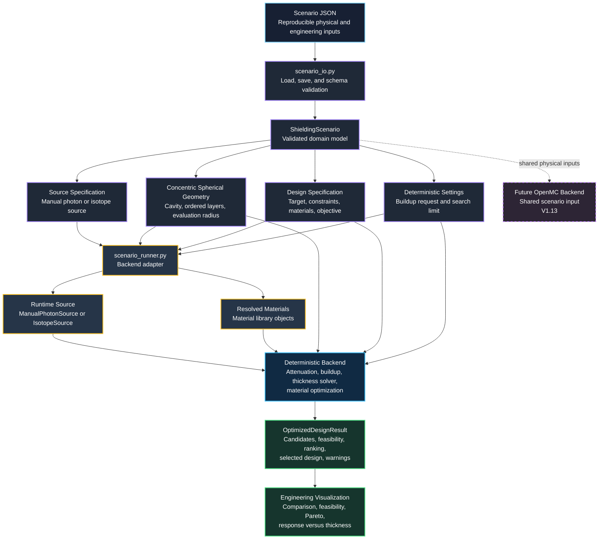

# V1.11 Scenario Architecture



## Architectural Intent

V1.11 introduces `ShieldingScenario` as the authoritative description of a shielding problem. Scenario files store physical and engineering inputs independently of the calculation backend.

The scenario runner converts serializable source and material identifiers into the existing runtime objects used by the validated deterministic calculation pathway. Physics calculations, optimization, and plotting remain separate from JSON parsing and scenario validation.

The same validated scenario model is planned to support the OpenMC backend beginning in V1.13. This reduces the risk that deterministic and Monte Carlo calculations silently use different source, geometry, target, or material inputs.

## Current V1.11 Path

```text
Scenario JSON
    ↓
scenario_io.py
    ↓
ShieldingScenario
    ↓
scenario_runner.py
    ↓
Deterministic optimizer
    ↓
OptimizedDesignResult
    ↓
Engineering figures
```

## Planned V1.13 Extension

```text
ShieldingScenario
    ├── Deterministic backend
    └── OpenMC photon-transport backend
```